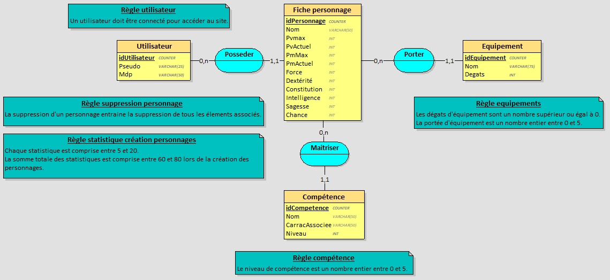

# wizardFactory
## MCD

## Definition of Done
- Le code doit respecter les normes PSR 1 / 4 / 12.
- Chaque ticket fait l'objet d'une PR relue et approuvée.
- Tests fonctionnels par les autres membres du groupe.
- Variables en anglais.
- Chaque commit et chaque branche doit avoir le numéro du ticket en plus des informations complémentaires.

## User Stories
- En tant qu'utilisateur je souhaite me connecter afin d'accéder au site
- En tant qu'utilisateur je souhaite créer une fiche personnage afin de stocker ses informations.
- En tant qu'utilisateur je souhaite modifier mes fiches personnage afin de les mettre à jour.
- En tant qu'utilisateur je souhaite supprimer mes fiches personnage afin d'épurer ma liste.
- En tant qu'utilisateur je souhaite avoir une liste de mes fiches personnage afin d'en avoir une vision globale.
- En tant qu'utilisateur Je souhaite consulter une fiche personnage en entier afin de prendre connaissance de toutes ses informations.
